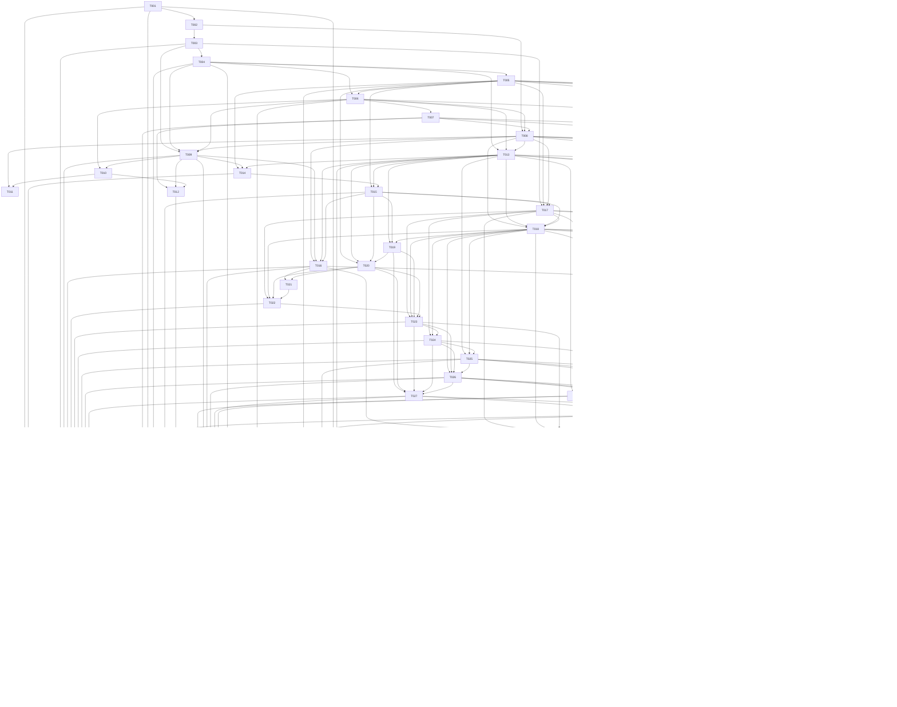

# Aufgabenabhängigkeiten

Die Pfeile zeigen Implementierungsvoraussetzungen, nciht die erzählerische Reihenfolge der Spielakte. Für die normale Bearbeitung genügt die Reihenfolge T001 bis T048.

Maschinenlesbare Aufträge und Abhängigkeiten stehen in [tasks.json](tasks.json). Kein automatischer Ausführungsrunner wird mitgeliefert.
